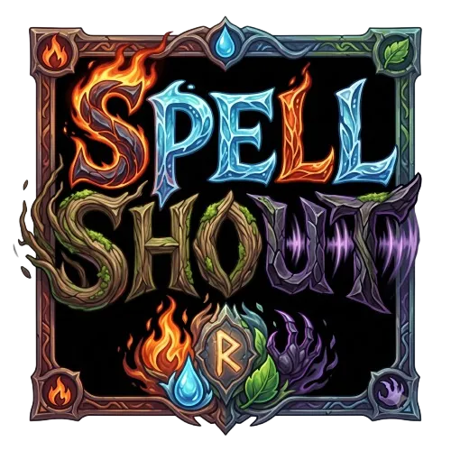

# Spellshout
**A monster battle game you play with your voice, powered by Wispr Flow.**

▶ **Play live:** https://spellshout.vercel.app/
🎬 **Demo video:** https://youtu.be/XnxLfI9uOrM

## What is it?
Spellshout is a turn-based monster battle game where every action is spoken: choosing creatures, casting spells, switching, guarding, picking rewards and rematching. No keyboard, mouse or controller is needed during play, so people who can't comfortably use them can play too.

## How Wispr Flow is used
- **Building:** the build started by dictating prompts to Claude Code through Wispr Flow. The first session is shown in the demo video.
- **Wispr Flow Mode (default):** hold your Wispr Flow hotkey, speak a spell, and Wispr Flow types it into the game, which casts it instantly.
- **Dictionary:** adding spell names to Wispr's Dictionary makes casting precise where browser speech recognition mishears them.
- **Snippets:** one spoken word (for example "firestorm") expands into two spell names and fires a combo.
- **Describe-your-attack ultimate:** speak a full sentence and it becomes a custom attack. This is where Wispr's accuracy on long speech shows.
- **Hands-free fallback:** no Wispr Flow? Choose "Play hands-free" and the game uses the browser's speech recognition.

## How to play
1. Open the game in Chrome or Edge on a desktop and allow microphone access. Headphones are recommended.
2. Choose **Play with Wispr Flow** (hold the hotkey, Ctrl + Win on Windows, and speak) or **Play hands-free**.
3. Say a creature's name to choose it, then say **"ready"** at your normal volume to calibrate.
4. Say the spell names shown on the cards. Shout for more power.

**Voice commands:** spell names · "switch to [creature]" · "guard" · reward names · "help" · "skip" · "mute" / "sound on" · "whisper mode" / "chrome mode" · "rematch"

## Features
- **Shout Power:** louder casts hit harder, and a full shout lands a SHOUT CRIT
- **Elements:** fire beats nature, nature beats water, water beats fire; shadow is neutral
- **Party of four:** switch by name; you lose only when all four faint
- **Mega attacks** unlock after 4 attacks, and **heals** after 3
- **Four-enemy gauntlet:** signature moves you counter by voice, ending in Voidcrown, a boss that shifts element every turn
- Rewards between fights, combos, quick casts, score and best score

## Creatures
| Creature | Element | Attacks | Mega | Heal |
|---|---|---|---|---|
| Blaze | Fire | Fire Punch, Hot Rock, Smoke Bomb, Lava Kick | Sun Strike | Warm Glow |
| Aqua | Water | Water Gun, Ice Ball, Rain Drop, Bubble Shot | Big Wave | Fresh Spring |
| Grove | Nature | Leaf Blade, Root Grab, Thorn Shot, Vine Whip | Earth Quake | Flower Bloom |
| Ghost | Shadow | Dark Claw, Night Bite, Moon Slash, Shadow Kick | Black Hole | Deep Sleep |

## Enemies
- **Cinderjaw** (fire): Burn
- **Maelstrom** (water): Tide Shield
- **Blightroot** (nature): Root
- **Voidcrown** (final boss): shifts element every turn and charges Cataclysm

## Tech stack
TypeScript · Phaser 3 · Vite · Web Speech API · Web Audio API (all sound effects generated in code) · Vercel

## Run locally
Requires Node.js 20 or newer. Run `npm install`, then `npm run dev`, and open the local URL in Chrome.

## Project structure
- `src/voice/` — Web Speech API and Wispr Flow input, transcript routing
- `src/audio/` — microphone loudness, calibration, and sound effects
- `src/matcher/` — phonetic spell and command matching
- `src/scenes/` — Phaser scenes for game flow (title, select, calibration, battle)
- `src/data/` — roster, damage, power, and ultimate rules
- `src/effects/` — visual battle effects
- `src/animations/` — sprite animation helpers
- `src/sprites/` — creature sprite construction
- `public/assets/` — logo, creature, and arena art
- `scripts/` — asset conversion and module test scripts

## Credits
- Built by Tarun Mhanta ([TarunMhanta30](https://github.com/TarunMhanta30)) with Claude Code and Wispr Flow
- Character and arena art generated with Google Gemini, then edited by Tarun
- Made for the Hacker House Goa 2026 Wispr Flow task
